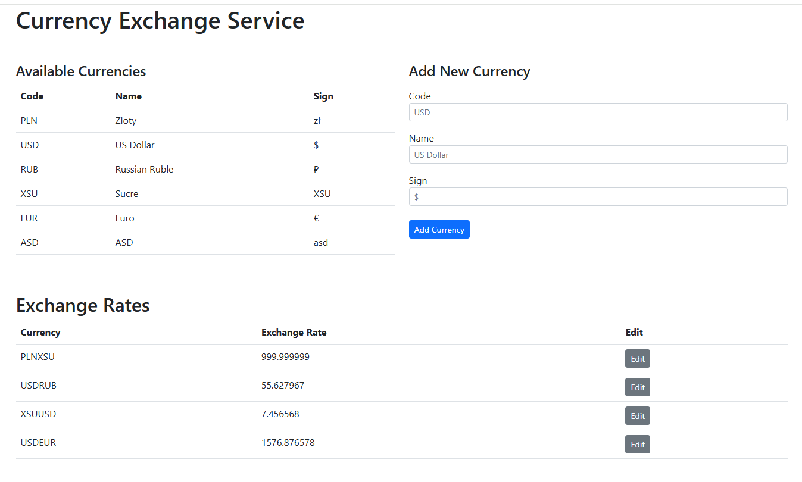

# Обмен валют

REST API для описания валют и обменных курсов с использованием MVC на Java Servlets. Позволяет просматривать и редактировать списки валют и обменных курсов, и совершать расчёт конвертации произвольных сумм из одной валюты в другую.

## Мотивация проекта

Изучить REST API, MVC, Deploy, SQL, Java Servlets.

## Стек
- Java 17.0.15.
- Tomcat 10.1.41
- Apache Maven 3.9.9
- SQLite3 3.46.1

## Структура программы (java)

- `config` — инициализация БД и установка параметров для HTTP ответов;
- `controller` — слой CONTROLLER, servlets, обработка запросов;
- `dao` — слой DAO, операции в БД;
- `dto` — объекты для перемещения между слоями/предназначенные для отправки во VIEW слой;
- `entity` — объекты, описывающие таблицы БД;
- `exceptions` — кастомные exceptions, описание типа ошибок;
- `mapper` — MAPPER между DTO-DAO;
- `response_utils` - утильный класс, предназначенный для перевода в JSON и формирования ответа/ошибки;
- `service` - слой SERVICE, бизнес логика, запросы к DAO;
- `validator` - проверка входящих параметров.

## Ресурсы (resources)

- `echanger.db` — БД, состоящая из 2-х таблиц, все изменения в БД сохраняются в памяти;

## Фронт (webapp)

- `js` -> `app.js` - расположение пути для корня REST API.

## Запуск программы

- git clone https://github.com/LlqWst/CurrencyExchanger.git 
- Указать в настройках Tomcat -> Deployment -> Application Context: '/CurrencyExchanger' (без кавычек)
- Запустить Tomcat